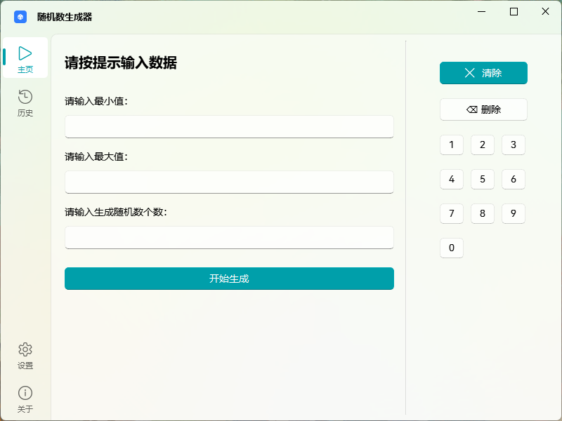
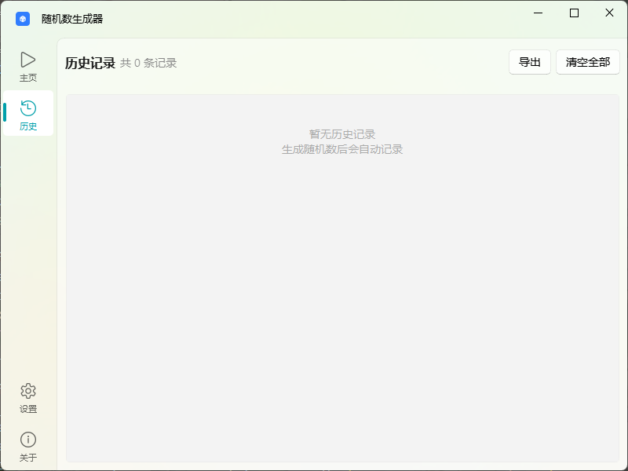
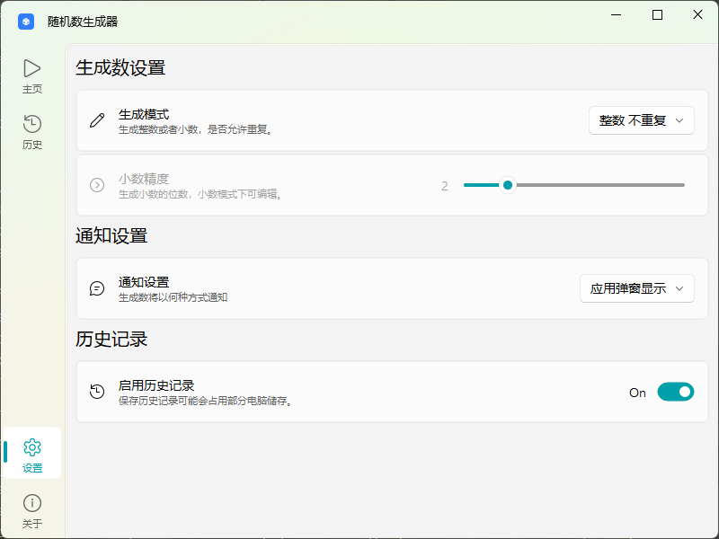

## 随机数生成器

---

    

---

## 应用预览

- 主页

- 历史记录页

- 设置页

---

## ✨ 特色功能

- **生成模式**
  
  - 🔢 整数/浮点数
  - 🔁 可重复/不重复
  - 📐 自定义小数精度（2~9 位）

- **输入面板**
  
  - 键盘自带 `0 ~ 9` 数字键，大屏操作时无需调出屏幕键盘
  - 键盘自带 `清空行` / `删除` 按钮

- **历史记录**
  
  - 📜 自动保存所有生成记录
  - 🔍 点击卡片可查看详情
  - 📤 可导出为 txt 文件
  - 🗑️ 历史记录可一键清空

- **结果展示**
  
  - 💬 应用内弹窗（推荐）
  - 🪟 Windows 原生通知（不完善）

- **现代化 UI**
  
  - 基于 `PySide6` 和 `QFluentWidgets` UI库
  - 界面美观，动画流畅
  - 部分界面支持亚克力效果

---

## 重要提示

>  [!TIP] 
> 
> 软件当前版本下并不完善，应用内出现不可控Bug请及时反馈

#### 支持的平台

- [x]  Windows 11 （推荐）

- [x]  Windows 10

- [ ]  Windows 7 及更低

- [ ]  Linux

- [ ] MacOS

---

## 技术栈

- Python 3.13

- PySide6

- QFluentWidget

- Inno Setup 7